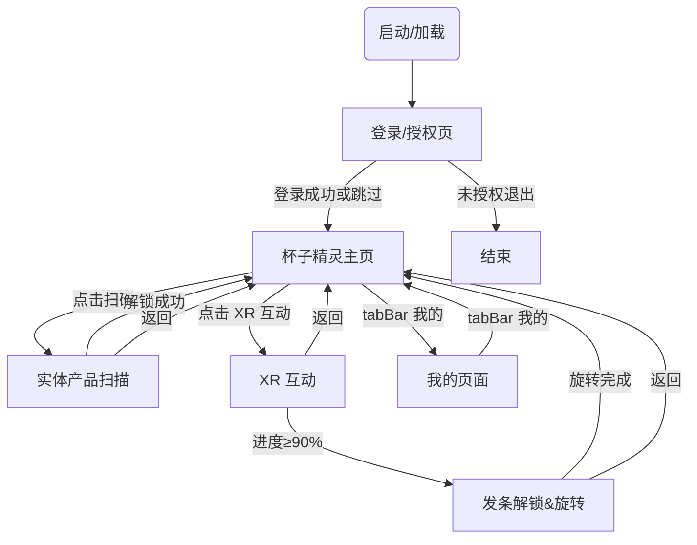

Trige Trip小程序开发文档

以下为最简版本小程序需要实现的核心页面描述，便于产品、设计与开发快速对齐。

# 节点字母说明
- **A** 启动/加载页
- **L** 登录/授权页
- **H** 杯子精灵主页
- **C** 实体产品扫描页
- **E** XR 互动（单页合并）
- **F** 发条解锁与旋转页
- **I** 我的页面

# 页面交互流程

# 路由表

| 标记 | 页面名称 | 小程序路径 | 入参 / Query | 出参 / 跳转 | tabBar | 需登录 |
| ---- | -------- | ---------- | ------------ | ----------- | ------ | ------ |
| A | 启动/加载 | `/pages/splash/index` | - | `redirect` → L 或 H | 否 | 否 |
| L | 登录/授权 | `/pages/login/index` | `redirect` (可选) | redirect 或 H | 否 | 否 |
| H | 主页-杯子精灵 | `/pages/home/index` | - | - | 是 | 否 (游客可用) |
| C | 实体产品扫描 | `/pages/scan/index` | `cardId` (可选) | H | 否 | 是 |
| E | XR 互动（单页合并） | `/pages/xr_interaction/index` | `cardId` | H | 否 | 是 |
| D | 卡牌详情 | `/pages/card/detail` | `cardId` | back | 否 | 是 |
| I | 我的页面 | `/pages/profile/index` | - | - | 是 | 是 |

# 小程序入口

### 入口形式一：微信搜索
- 用户在微信内搜索小程序名称“Trige Trip”进入主页。
- 若未登录，按登录流程引导进入登录页。

### 入口形式二：NFC 贴纸
- 用户用支持 NFC 的手机靠近卡牌，系统弹出微信 NFC 标签入口。
- 点击入口后直接打开小程序，并跳转到“未解锁”的卡牌详情页。
- 进入路径建议：`/pages/card/detail?cardId=xxx`，由页面内逻辑判断解锁状态并展示“未解锁”态。

#### NFC 入口开发说明
- 在微信公众平台开启 NFC 标签能力，并为每张卡牌生成 NFC 标签指向的小程序路径。
- NFC 标签建议写入「小程序码/URL Scheme」或「NFC 标签跳转小程序」配置（由后台生成）。
- 小程序 `card/detail` 页面需支持 `cardId` 参数并根据解锁状态展示不同 UI。
- 后端/云函数需提供 `cardId` 的解锁状态查询接口（如 `GET /api/card/state?cardId=`）。
- 建议在 `app.onLaunch` 或页面 `onLoad` 里记录入口来源（search / nfc），用于统计。

# 鉴权 / 跳转守卫逻辑

# 关键页面设计
## 页面A. 启动/加载页
用户故事 / 场景  
- 作为用户，我可以在进入小程序等待的时间不那么无聊，看到简单的小动画

功能点  
1. 展示启动动画（Logo、进度条、Slogan），并在加载过程中保持界面流畅
2. 检查本地登录态（token 是否存在/是否过期）并决定后续跳转：登录页或主页
3. 预加载必要静态资源（如精灵动画首屏资源、常用图标）
4. 拉取全局配置（开关、文案、活动配置等），失败时使用本地默认配置

接口 / 数据  
- 本地：`storage.get('token')`、`storage.get('cards')`、`storage.get('badges')`
- `GET /api/config` → `{ featureFlags, uiConfig }`
- `GET /api/version` → `{ latestVersion, minSupportedVersion, updateTip }`

备注 / 优先级  
- **优先级：中**（不影响核心玩法，但强烈影响首屏体验）
- 若接口超时（例如 >2s）应直接进入主页并在后台重试拉配置
- 若检测到版本不兼容（minSupportedVersion）需引导更新/提示不可用

前端
- **主要元素**
  - App Logo（中心放置，SVG 矢量）
  - 进度指示条（细线、渐变）
  - Slogan 文案：「Scan • Collect • Play」
- **设计风格**  
  - 极简、留白，突出品牌 Logo  
  - 采用淡入淡出动效
- **主题色 & 背景**  
  - 纯白 `#FFFFFF` 背景  
  - Logo 使用品牌主色「Tangerine Orange」`#FF7A23`  
  - 进度条渐变：`#FFB95A → #FF7A23`

## 页面L. 登录／授权页

用户故事 / 场景  
- 作为用户，我进入登录页完善头像与昵称后继续使用小程序功能。

功能点  
1. 页面提示“欢迎来到 Trige Trip”，说明需设置头像与昵称。  
2. 点击头像按钮，使用 `open-type="chooseAvatar"` 选择微信头像并实时预览。  
3. 昵称输入框支持 `type="nickname"`，输入后更新页面展示值。  
4. 点击“确认”按钮，校验昵称必填。  
5. 首次进入时调用云函数 `login` 获取 `openid` 并缓存。  
6. 头像若为临时文件路径则上传到云存储，再调用 `updateUser` 更新头像与昵称。  
7. 更新成功后跳转到加载页 `/pages/loading/index`。

接口 / 数据  
- 云函数 `login` → 返回 `{ openid }`  
- 云函数 `updateUser` body: `{ avatarUrl, nickname }`  
- 云存储上传头像：`avatars/{timestamp}-{random}.png`

备注 / 优先级  
- **优先级：高**（进入加载页前需完成昵称校验）  
- 头像上传失败时给出提示并阻止继续跳转。

前端
- **主要元素**
  - 欢迎标题 + 品牌名 + 提示文案
  - 头像选择区（按钮 + 头像预览）
  - 昵称输入框
  - 底部确认按钮
- **设计风格**  
  - 居中排版、表单分区清晰  
  - 强调品牌标题与引导文案
- **主题色 & 背景**  
  - 视觉保持简洁，重点突出按钮与品牌文字

## 页面C. 实体产品扫描页（卡牌解锁）

用户故事 / 场景  
- 作为用户，我想使用实时摄像头对准实体产品。当实体产品对准界面卡牌上的杯子轮廓边缘时，系统应提示扫描成功并解锁卡牌。

功能点  
1. 请求摄像头权限并全屏展示预览 (`wx.authorize`, `camera` 组件)  
2. 绘制灰色卡牌占位框 (3:4 比例，圆角阴影)  
3. 实时检测二维码 → 判断是 4 种杯子中的哪一种  
4. 进入图像识别：轮廓对齐检测（OpenCV / TensorFlow JS / 云端 Vision API）  
5. 对齐成功  
   - 震动或粒子动画反馈  
   - 调用 `/api/card/unlock` 解锁对应卡牌  
   - 本地缓存卡牌状态，跳转「卡牌详情」页  
6. 对齐失败  
   - 提示文字「请将杯子放入框内」闪烁  
7. 顶部返回按钮：返回主页  
8. 帮助按钮：弹出识别指引弹窗  
9. 日志 & 埋点：扫码开始、成功、失败原因
10.解锁后自动跳转到主页杯子精灵页面

接口 / 数据  
- `GET /api/qr/validate?code=` → `{ cardId, cupType }`  
- `POST /api/card/unlock` body: `{ cardId, token }` → `{ success, cardInfo }`  
- 本地缓存：`storage.set('cards', [cardIds])`  
- 识别模型：`/assets/models/cupContour.tflite` (小程序端) 或 云端 API

备注 / 优先级  
- **优先级：高**（玩家核心流程）  
- 图像识别 SDK 体积需 < 4MB，或采用云端识别 + loading  
- 需在暗光场景测试识别率 ≥ 95%  
- 扫码时锁定屏幕亮度，避免息屏  

- **主要元素**
  - 顶部返回按钮 & 帮助图标
  - 实时摄像头画面（全屏）
  - 居中灰色卡牌占位框（ 3:4 比例，带圆角阴影）
  - 提示文字：「将杯子放入框内以解锁卡牌」
  - 底部灯条识别进度动画
- **设计风格**  
  - 半透明 UI 覆盖在摄像头画面上  
  - 卡牌使用浅灰 `#F1F1F1` 填充 + 虚线轮廓
- **主题色 & 背景**  
  - 摄像头画面为背景  
  - UI 组件使用品牌辅助色 `#4C4C4C` 字体

## 页面H. 杯子精灵页（主页）

用户故事 / 场景  
- 作为用户，我希望与已解锁的杯子精灵进行趣味互动；当尚未解锁时，希望获得明确的指引去解锁精灵。  
- 我希望可以通过「XR 互动」快速进入扫描页，继续完成收集任务。  
- 我需要在屏幕底部便捷地切换「杯子精灵」与「我的」两个一级页面。

功能点  
1. **全屏视频精灵**  
   - 使用 `<video>` 组件（CDN mp4）。  
   - 进入页面即自动播放一次 `catlook.mp4`（≈ 5 s）。  
   - 视频结束后显示占位图 `catstop.png`，停留 10 s，再播放 `catlook.mp4`，循环往复。  

2. **点击互动**  
   - 用户点击屏幕时随机播放一次 `catdance / catspeak / catyawn` 其一并播放视频自带音效。  
   - 互动视频结束后立刻回到 `catstop.png` 并恢复 10 s 空闲循环。  

3. **页面切换控制**  
   - 当用户通过任何方式离开主页（tab 切换或跳转），`<video>` 将立即 `stop()`，音轨同时停止。  
   - 返回主页时重新从 `catlook.mp4` 首帧开始，重建空闲循环，保证每次进入都从头开始体验。  

4. **空状态引导**（保留）  
   - 若 `cards.length === 0`，显示插画 +「去解锁」按钮，跳转卡牌扫描页 D。  

5. **「XR 互动」按钮**  
   - 页面底部悬浮主按钮 `xrExploreBtn`，`catchtap` 后跳转 XR 互动页面（页面 E）。  

6. **底部 tabBar**  
   - 系统 tabBar：主页 / 我的。未读时在“我的”显示红点提示。  

备注 / 优先级  
- **优先级：高**（核心留存页面）  

前端
- **主要元素**  
  - 顶部 `topBar`：品牌 Logo + 背景音乐开关。  
  - 全屏 `<video>` 精灵画面（占位图 + 动画 mp4）。  
  - `emptyState` 组件：插画 + CTA 按钮。  
  - 悬浮 `xrExploreBtn`：主按钮，带发光动效。  
  - `tabBar`：主页 / 我的，两枚图标文本。  

- **设计风格**  
  - 卡通 + 轻拟物；按钮使用轻微投影与高光。  
  - 场景光照柔和，精灵主体高亮呈现。  

- **主题色 & 背景**  
  - 主色 `#FFB400`，强调色 `#FF6F00`。  
  - 背景采用从 `#FFFBE6` → `#FFFFFF` 的径向渐变，并叠加低透明度星光粒子动画。  

## 页面E. XR 互动（单页合并）

### 用户故事 / 场景
- 作为用户，我从主页的“XR 互动”按钮进入该页面，在一个页面内连续完成三个互动：形状扫描 → 发条解锁与旋转 → 吹灭蜡烛。
- 流程连续进行，步骤间通过过渡动画衔接，不发生页面跳转。

### 页面结构（固定）
- 顶部 `topBar`：返回按钮 + 音乐开关/品牌元素（全流程可返回主页）。
- 全屏背景区：步骤 1/2 使用 `camera`，步骤 3 使用烛光动画背景。
- 叠加层：根据 `step` 显示 ROI/Canvas、发条轮廓/引导、蜡烛动画/提示。
- 过渡动画层：步骤切换时淡入淡出或全屏转场。

### 状态机
- `step = scan → winder → blow → done`

---

## Step 1：扫描识别（原页面 E）

### 用户故事 / 场景
- 作为用户，我需要将摄像头框依次对齐13组图案，每个图案组是由4个❌和1个●由上至下排列组成的（位置不同），每一组图案识别准确了会发出对应的音符的声音，界面上会实时反馈到用户识别的图案是否准确提示，只有依次准确的识别到了13组图案（有固定顺序模板），这个step1识别任务才能完成，并看到转场动画进入下一个step2.

### 功能点
1. **实时摄像头预览**：使用 `camera` 组件，并通过 `onCameraFrame` 实时获取视频帧数据。
2. **居中竖向 ROI 框**：固定竖向矩形框（100*700 rpx），带呼吸动画，引导识别区域对准。
3. **云托管整组模式识别（推荐）**
   - 客户端裁剪 ROI 图像并上传云托管服务（建议短边 480px 压缩）。
   - 云托管使用整组分类模型识别 6 类模式（`pattern_circle_1~5` + `pattern_all_cross`）。
   - 同时返回模式标签、模式置信度，以及用于可视化的 5 个图形框（按纵向排序）。
4. **可视化反馈**
   - 叠加透明 Canvas 层，实时绘制识别到的图形与其 `y` 坐标指示线。
   - 识别结果高亮：绿色-圆形，橙色-叉，半透明白-空。
   - 顶部实时显示形状组合，如 `● ❌ — ❌ —`。
5. **识别判定与音符触发**
   - **模式合法性校验**：仅接受 6 类标签：`pattern_circle_1~5`、`pattern_all_cross`；其余视为无效帧。
   - **模式映射**：将 `pattern_circle_1~5` 映射为 circle 序位（1~5），`pattern_all_cross` 映射为“无圆”。
   - **步骤匹配**：当前识别模式必须与 `TARGET_PATTERN_SEQ[currentTargetIndex]` 一致，才算当前帧命中。
   - **命中反馈**：命中时 Toast 提示音符名称，并播放音效（当前为震动代替）。
6. **进度累计与完成**
   - 按顺序完成 13 次目标模式识别（有重复音符）。
   - 仅当当前帧命中 `CIRCLE_IDX_SEQ` 对应步骤时才计为成功。
   - 成功判定后等待 2 秒进入下一任务。
   - 完成 13 次后显示“扫描完成”，播放过渡动画，`step = winder`。

### 13 次目标模式序列（按 circle 的纵向序位 1–5 对应；`●`=圆形，`❌`=叉）

| 步骤 | 目标模式 | 触发音符 |
| ---- | -------- | -------- |
| 1 | ❌❌❌❌● | B4 |
| 2 | ❌❌❌❌● | B4 |
| 3 | ❌❌❌●❌ | C5 |
| 4 | ❌❌❌❌● | B4 |
| 5 | ❌●❌❌❌ | E5 |
| 6 | ❌❌●❌❌ | D5 |
| 7 | ❌❌❌❌❌ | 无（不发声） |
| 8 | ❌❌❌❌● | B4 |
| 9 | ❌❌❌❌● | B4 |
| 10 | ❌❌❌●❌ | C5 |
| 11 | ❌❌❌❌● | B4 |
| 12 | ●❌❌❌❌ | F5 |
| 13 | ❌●❌❌❌ | E5 |

### 接口 / 数据
- **云托管整组模式识别**：`POST /api/vision/roi`
  - 请求：`{ imageBase64, seq, timestamp, roiXRatio, roiYRatio, roiWRatio, roiHRatio }`
  - 响应：`{ patternLabel, patternScore, slots:["circle"|"cross"], confidence, latencyMs, items:[{x,y,w,h,label,confidence}] }`
- **云托管处理流程（ROI 识别）**
  1. Base64 解码 → 灰度化 → CLAHE（抗光照） → 高斯降噪。
  2. ROI 裁剪后输入整组 6 分类模型（`pattern_circle_1~5` + `pattern_all_cross`）。
  3. 输出 `patternLabel` 与 `patternScore`（模式置信度）。
  4. 服务端按模式映射生成 5 个纵向图形标签（`slots`）与可视化框（`items`）。
  5. 前端使用 `patternLabel` 进行步骤匹配，`items` 仅用于叠加显示。
- **识别节流/超时建议**：单次调用超时 1200ms；并发仅允许 1 个请求；连续 2 次超时触发“请调整光线”。
- **音频资源**：`playNoteAudio`（当前为震动替代，后续可扩展云端 mp3）。

### 备注 / 优先级
- **优先级：高**（核心玩法）。
- 云托管识别对光照适应性更好，适合真实用户环境。
- 客户端需做节流与超时重试，避免重复计数。
- 识别阈值建议：`confidence >= 0.65` 才计为有效结果；连续 2 帧稳定后判定为命中。
- **抗光照/透视策略**：CLAHE + 自适应阈值 + 透视矫正归一化（用户无需精确对齐）。
- **抗距离策略**：基于主轮廓裁剪后缩放至固定尺寸，再做模板匹配。
- 推荐图像压缩：短边 480px、JPEG 质量 0.6，单帧体积控制在 80KB 内。
- **异常处理**：
  - 识别超时提示“识别中断，请保持对齐再试”。
  - 连续 3 次超时提示“光线不足，请移动到更亮位置”。
- **弱网兜底**：
  - 超时 3 次降频到 3fps，并提示“网络不稳定，已降低识别频率”。
- **埋点字段**：`targetIndex`, `pattern`, `confidence`, `latencyMs`, `retryCount`, `note`。
- **关键埋点**：识别命中、任务完成、超时失败。

### UI 状态
- **状态切换**：`scanning` → `matched` → `cooldown` → `scanning` → `completed`。
- **显隐规则**：
  - ROI 框与分段线：`scanning/matched/cooldown` 显示，`completed` 隐藏。
  - 识别组合文本：`scanning/matched` 显示，`cooldown` 灰化。
  - 进度条：全程显示，`completed` 固定 100%。
  - 成功提示：仅 `matched` 显示 800ms。
- **事件流转**：
  - `onFrame` → `scan` → `matched` → `cooldown` → `scan`。
  - `currentTargetIndex === 13` → `completed` → 过渡动画 → `step=winder`。

### 前端
- **主要元素**：摄像头背景、ROI 框与分段线、Canvas 实时识别层、顶部识别模式文本与进度条。
- **设计风格**：深色模式，亮色高亮。
- **主题色**：ROI 框及高亮颜色：白色、橙色（`#FF7A23`）、绿色。

---

## Step 2：发条解锁与旋转（原页面 F）

### 功能点
1. 继续使用 `camera` 背景，复用相机权限与帧流。
2. 发条轮廓扫描：OpenCV 云托管模板/轮廓匹配，返回对齐分数与角度。
3. 对齐成功反馈：发条图标点亮 + 震动 + 轻提示音。
4. 旋转引导：顺时针指示箭头 + “滑动旋转上发条”文案。
5. 监听 Touch 事件累计旋转角度，达到 360° 触发成功（支持 2 圈以内容错）。
6. 播放八音盒动画 & 音乐，展示成就解锁弹窗。
7. 播放过渡动画后 `step = blow`。
8. 顶部返回按钮：中途中断可返回主页。

### 接口 / 数据
- `POST /api/winder/unlock` body: `{ cardId }` → `{ success, badge }`
- `GET /api/winder/state?cardId=` → `{ unlocked:boolean, rotatedDegree }`
- 本地动画资源：`/assets/anim/winder.json`, `/assets/anim/music_box.json`
- **OpenCV 云托管识别**：`POST /api/vision/winder`
  - 请求：`{ imageBase64, roi: { x,y,width,height }, seq, timestamp }`
  - 响应：`{ aligned:boolean, score, angle, latencyMs, reason }`
  - reason 可选值：`LOW_SCORE` / `NO_CONTOUR` / `BLUR`
- **云托管处理流程（发条对齐）**
  1. ROI 灰度化 + 边缘检测（Canny）。
  2. 轮廓提取 → 关键点匹配 / 模板匹配。
  3. 输出对齐分数 `score` 与旋转角 `angle`。

### 备注 / 优先级
- **优先级：高**（收官任务 + 成就系统）。
- 旋转手势需流畅，建议基于 `requestAnimationFrame` 计算角度。
- 音乐播放需提前缓存，避免卡顿。
- 游客模式仅可观看示例动画，无法上传解锁。
- 识别阈值建议：`aligned === true` 且 `score >= 0.7` 才进入旋转步骤。
- **失败提示文案**：
  - “发条还没对齐，请将图案放在框内”
  - “光线不足，请移动到更亮的位置”
- **超时策略**：
  - 单次对齐识别超时 1200ms；连续 2 次超时提示重试。
  - 8 秒未对齐成功时，显示引导卡片（示意图 + 操作提示）。
- **成功提示文案**：
  - “对齐成功！请顺时针旋转发条”
  - “旋转完成，八音盒启动中”
- **性能策略**：
  - 对齐识别仅在 `step=winder` 且未进入旋转时开启。
  - 成功进入旋转后停止识别请求。
  - 云托管并发限制 1 请求，避免卡顿。
- **旋转角度计算**：
  - 以发条中心点为原点，计算触点角度 `atan2(dy, dx)`。
  - 记录上一个角度与当前角度的差值，累加为 `totalRotate`。
  - 角度跳变超过 180° 时做归一化（避免反向跳变）。
- **触摸路径容错**：
  - 触点距离中心需在 `rMin~rMax` 环内，超出则忽略该帧。
  - 允许 15° 以内的逆向抖动，不计入总角度。
  - 旋转过程中若抬手，允许继续累积，最长 6 秒内完成。
- **发条旋转动效节奏**：
  - 旋转时发条图标同步旋转，阻尼 0.85 平滑跟随。
  - 360° 达成后，追加 120° 回弹动画（200ms）。
  - 八音盒启动动画 2s（齿轮转动 + 微光）。
- **交互状态机**：`scan` → `aligned` → `rotating` → `completed` → `done`。
- **旋转完成判定**：累计角度 ≥ 360°；5 秒内未完成则提示“继续顺时针滑动”。
- **Touch 事件流程**：
  - `touchstart`：记录起始角度与时间，若未对齐则忽略。
  - `touchmove`：计算角度增量并累加；若触点离开半径范围则暂停累计。
  - `touchend`：保留累计角度，若未达标则提示继续旋转。
- **UI 文案**：
  - `scan`：文案“请将发条图案对齐框内”
  - `aligned`：文案“对齐成功！顺时针旋转发条”
  - `rotating`：文案“继续旋转中…”
  - `completed`：文案“旋转完成，启动八音盒”
- **UI 显隐规则**：
  - 发条轮廓框：`scan/aligned/rotating` 显示，`completed` 降低透明度。
  - 旋转引导箭头：仅 `aligned/rotating` 显示。
  - 对齐提示条：仅 `scan` 显示。
  - 旋转进度环：仅 `rotating` 显示。
  - 成功动画与八音盒：仅 `completed` 显示。
- **错误码与埋点建议**：
  - `WINDER_TIMEOUT`：对齐超时
  - `WINDER_LOW_SCORE`：对齐分数不足
  - `WINDER_ABORT`：用户中途退出
  - `WINDER_NET_ERROR`：云托管请求失败
  - 关键埋点：进入步骤、对齐成功、开始旋转、完成旋转、超时失败、网络异常
- **异常处理**：
  - 云托管返回失败时，展示“网络不稳定，请稍后再试”。
  - 识别返回 `aligned=false` 时仅提示对齐，不进入旋转。
  - 旋转过程中若切后台，回到 `aligned` 状态并保留累计角度 3 秒。
- **reason → 文案映射**：
  - `LOW_SCORE`："对齐度不足，请将图案更居中"
  - `NO_CONTOUR`："未识别到发条轮廓，请对准图案"
  - `BLUR`："画面有点糊，保持手机稳定"
- **UI 反馈策略**：
  - reason 文案以顶部轻提示条展示，显示 1.5s。
  - 同一 reason 2s 内不重复提示，避免闪烁。
- **识别节奏**：
  - 发条对齐识别频率 6–8fps，失败时保持 6fps。
  - 成功进入 `aligned` 后停止识别请求。
- **弱网兜底**：
  - 若 3 次请求超时，自动降频到 3fps，并提示“网络不稳定，识别频率已降低”。
- **埋点字段**：`reason`, `score`, `latencyMs`, `retryCount`, `rotateDuration`, `alignedAt`。
- **动画预加载**：进入 Step 2 时预加载 `winder.json` 与 `music_box.json`。
- **重试与兜底**：
  - 每次失败后允许立即重试；连续 5 次失败弹出示例动图。
  - 连续 3 次失败后降低 `score` 阈值到 0.65（仅本次会话）。

### 前端
- **主要元素**：发条轮廓占位（半透明线框）、旋转引导箭头、摄像头背景、成功动画与八音盒形象。
- **设计风格**：机械蒸汽朋克细节：齿轮、铜色光泽。
- **主题色**：暗金 `#B68C31`，扫描框 `rgba(255,255,255,0.15)`。

---

## Step 3：吹灭蜡烛（原页面 G）

### 用户故事 / 场景
- 界面显示蛋糕与蜡烛摇曳动画，用户通过手机麦克风吹灭蜡烛。成功后完成整个 XR 互动并展示成就解锁。

### 功能点
1. 切换为烛光动画背景，不使用摄像头。
2. 请求麦克风权限，启动音量采样（建议 20fps）。
3. 吹气判定：连续 600ms 达到阈值（RMS ≥ 0.35）触发熄灭。
4. 蜡烛熄灭动画 + 轻微粒子上升效果。
5. 播放庆祝动画 + 成就解锁弹窗。
6. 完成后可跳转主页或停留查看成就（`step = done`）。

### 接口 / 数据
- `POST /api/achievement/complete` body: `{ cardId, type:"blow" }` → `{ success, badge }`

### 备注 / 优先级
- **优先级：高**（流程收束与成就展示）。
- 失败提示与性能策略见下方补充（Step 3 详细说明）。
- 麦克风权限拒绝时展示“点击重试”入口，并允许跳过为演示模式。
- 吹气阈值建议：`0.30~0.40` 之间可在真机上调参。
- **失败提示文案**：
  - “没有检测到吹气声音，请靠近手机再试一次”
  - “环境太吵啦，换个安静的地方再试试”
- **成功文案**：
  - “太棒啦！蜡烛已熄灭”
  - “恭喜解锁成就：生日快乐”
- **性能建议**：
  - 吹气检测仅在 `step=blow` 时启动，成功后立即停止采样。
  - 若 8 秒内未触发成功，提示“保持对着麦克风轻吹”。
  - 采样结果做 3 帧滑动平均，降低抖动误触。
- **交互与动画节奏建议**：
  - 进入步骤后先播放 1.2s 蜡烛点燃与摇曳过场，再提示“请对着麦克风轻吹”。
  - 吹气检测成功后先快速暗下火焰（150ms），再播放 600ms 烟雾上升。
  - 庆祝动画持续 2.5s，结束后展示成就弹窗。
- **声音提示建议**：
  - 吹气检测开始时播放轻提示音（短促、低音）。
  - 熄灭成功播放“噗”的小音效，再进入庆祝音乐。
- **兜底引导**：
  - 若连续 3 次失败，弹出引导卡片：
    - “把手机麦克风靠近嘴边”
    - “用轻吹而不是大喊”
    - “避免风扇/空调直吹干扰”
- **视觉动效参考（火焰/烟雾）**：
  - 火焰 Idle：随机 3 帧轻摆动（0.2~0.3s/帧）。
  - 成功触发：火焰缩放到 0.2（150ms）→ 透明度降到 0（150ms）。
  - 烟雾：上升 20~30px，透明度 1→0（600ms）。
- **成就弹窗结构**：
  - 标题：`恭喜解锁成就`
  - 副标题：`生日快乐`
  - 内容：徽章图标 + 文案 `你完成了全部互动任务`
  - 按钮：`返回主页`（主按钮）、`留在此页`（次按钮）
- **交互状态机**：`idle` → `intro` → `listening` → `success` → `done`。
- **失败提示文案（补充）**：
  - 低音量：`"吹得太轻了，再试一次"`
  - 环境噪声过大：`"环境有点吵，靠近蜡烛再吹"`
  - 权限拒绝：`"需要麦克风权限才能完成"`
- **过程引导文案**：
  - 进入提示：`"对着手机轻轻吹一口气"`
  - 成功提示：`"蜡烛已熄灭，生日快乐！"`
- **性能策略**：
  - 采样数据 2 秒滑动窗口，避免长时间累计。
  - 连续 3 次失败时，降低阈值 10% 并提示用户靠近。
  - 完成后立即停止麦克风采样释放资源。
- **埋点字段**：`blowLevel`, `threshold`, `durationMs`, `failCount`, `latencyMs`, `noiseLevel`。
- **关键埋点**：开始监听、吹气成功、失败提示、成就弹窗展示。
- **UI 状态切换**：
  - `intro`：播放点燃动画并显示“准备吹气”。
  - `listening`：展示音量波动提示与“对着麦克风轻吹”。
  - `success`：熄灭动画 + 祝贺文案。
  - `done`：成就弹窗与按钮。
- **UI 显隐规则**：
  - 蜡烛动画：`intro/listening/success` 显示，`done` 降低透明度。
  - 音量波形：仅 `listening` 显示。
  - 祝贺文案：`success` 显示 2s。
  - 成就弹窗：仅 `done` 显示。
- **事件流转**：
  - `intro` 结束 → `listening`。
  - 检测到吹气成功 → `success` → `done`。
  - 超时或失败 → 仍保持 `listening` 并提示重试。
- **异常处理**：
  - 麦克风权限拒绝：展示权限说明并提供“去设置”按钮。
  - 持续噪声过高：提示“环境噪声过大，请换个安静位置”。
- **小程序实现结构建议**：
  - `data`：`blowState`, `blowLevel`, `failCount`, `showGuideCard`, `showAchievement`, `audioReady`。
  - `methods`：`initBlow()`, `startListen()`, `stopListen()`, `onAudioFrame()`, `handleSuccess()`, `handleFail()`。
  - `timers`：`introTimer`, `listenTimer`, `timeoutTimer` 统一在 `onUnload` 清理。
  - 音量算法：使用 RMS + 3 帧滑动平均，避免尖峰误触。
  - 资源组织：音效与动画分包（如 `assets/audio/blow.mp3`, `assets/anim/candle.json`）。

---

## 权限与资源管理（单页优势）
- 摄像头仅初始化一次（步骤 1/2 复用）。
- 麦克风仅在步骤 3 请求。
- 动画资源预加载，确保过渡顺滑。
- 全流程通过 `step` 状态机管理，体验连续统一。

## 页面I. “我的”页
用户故事 / 场景  
-作为用户，我可以在这个页面中看到我当前收集到的角色卡牌（目前只有杯子精灵一种，以后会有其他产品），收集到的成就（完成上发条任务则会收集到生日快乐成就徽章）。我还可以在这个页面中看到一些编辑个人信息的入口，开发者详情之类的内容入口。底部tab bar可以切换主页和“我的”页。
功能点  
1. 显示用户头像、昵称、UID  
2. 卡牌收集统计：已解锁 / 总数，点击进入卡牌列表页  
3. 徽章墙：网格展示已获得徽章，点击查看说明  
4. 设置入口：账号与隐私、清理缓存、意见反馈  
5. 编辑个人信息（头像上传、昵称修改）  
6. 分享小程序 / 邀请好友按钮  

接口 / 数据  
- `GET /api/user/profile` → `{ avatarUrl, nickname, uid }`  
- `GET /api/user/cards/summary` → `{ unlocked, total }`  
- `GET /api/user/badges` → `{ badges:[{ id, name, icon }] }`  
- `PUT /api/user/profile` body: `{ avatarUrl?, nickname? }` → `{ success }`  
- `POST /api/feedback` body: `{ content }` → `{ success }`  

备注 / 优先级  
- **优先级：中**（用户粘性、信息中心）  
- 所有接口需鉴权，token 失效时跳登录  
- 上传头像需走对象存储并取临时凭证  
- 游客模式头像显示默认灰色，编辑按钮隐藏 
前端：
- **主要元素**
  - 头部用户信息栏
  - 已收集卡牌数量统计
  - 徽章墙预览
  - 设置入口
  - 一级页面的tab bar
- **设计风格**  
  - 轻量、信息卡片分块  
  - 使用圆角矩形卡片
- **主题色 & 背景**  
  - 纯白 `#FFFFFF` ，顶部使用品牌色渐变遮罩
