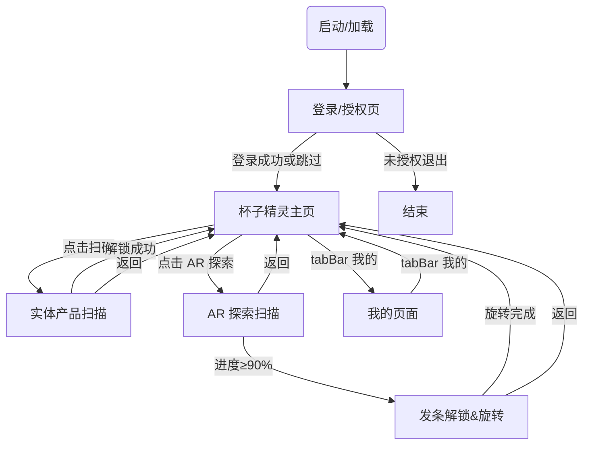

Trige Trip小程序开发文档

以下为最简版本小程序需要实现的核心页面描述，便于产品、设计与开发快速对齐。

# 节点字母说明
- **A** 启动/加载页
- **L** 登录/授权页
- **H** 杯子精灵主页
- **C** 实体产品扫描页
- **E** AR 探索扫描页
- **F** 发条解锁与旋转页
- **I** 我的页面

# 页面交互流程

# 路由表

| 标记 | 页面名称 | 小程序路径 | 入参 / Query | 出参 / 跳转 | tabBar | 需登录 |
| ---- | -------- | ---------- | ------------ | ----------- | ------ | ------ |
| A | 启动/加载 | `/pages/splash/index` | - | `redirect` → L 或 H | 否 | 否 |
| L | 登录/授权 | `/pages/login/index` | `redirect` (可选) | redirect 或 H | 否 | 否 |
| H | 主页-杯子精灵 | `/pages/home/index` | - | - | 是 | 否 (游客可用) |
| C | 实体产品扫描 | `/pages/scan/index` | `cardId` (可选) | H | 否 | 是 |
| E | AR 探索扫描 | `/pages/ar/index` | `cardId` | F | 否 | 是 |
| F | 发条解锁与旋转 | `/pages/winder/index` | `cardId` | H | 否 | 是 |
| D | 卡牌详情 | `/pages/card/detail` | `cardId` | back | 否 | 是 |
| I | 我的页面 | `/pages/profile/index` | - | - | 是 | 是 |

# 鉴权 / 跳转守卫逻辑

# 关键页面设计
## 页面A. 启动/加载页
用户故事 / 场景  
- 作为用户，我可以在进入小程序等待的时间不那么无聊，看到简单的小动画

功能点  
1. 展示启动动画（Logo、进度条、Slogan），并在加载过程中保持界面流畅
2. 检查本地登录态（token 是否存在/是否过期）并决定后续跳转：登录页或主页
3. 预加载必要静态资源（如精灵动画首屏资源、常用图标）
4. 拉取全局配置（开关、文案、活动配置等），失败时使用本地默认配置

接口 / 数据  
- 本地：`storage.get('token')`、`storage.get('cards')`、`storage.get('badges')`
- `GET /api/config` → `{ featureFlags, uiConfig }`
- `GET /api/version` → `{ latestVersion, minSupportedVersion, updateTip }`

备注 / 优先级  
- **优先级：中**（不影响核心玩法，但强烈影响首屏体验）
- 若接口超时（例如 >2s）应直接进入主页并在后台重试拉配置
- 若检测到版本不兼容（minSupportedVersion）需引导更新/提示不可用

前端
- **主要元素**
  - App Logo（中心放置，SVG 矢量）
  - 进度指示条（细线、渐变）
  - Slogan 文案：「Scan • Collect • Play」
- **设计风格**  
  - 极简、留白，突出品牌 Logo  
  - 采用淡入淡出动效
- **主题色 & 背景**  
  - 纯白 `#FFFFFF` 背景  
  - Logo 使用品牌主色「Tangerine Orange」`#FF7A23`  
  - 进度条渐变：`#FFB95A → #FF7A23`

## 页面L. 登录／授权页

用户故事 / 场景  
- 作为用户，我想要快速登录，可以分别自动使用我的微信昵称和头像。

功能点  
1. 点击头像位置自动获取并展示微信头像
2.点击名称输入位置自动获取并展示微信名称
3. 用户协议 & 隐私协议勾选校验，未勾选禁止点击登录  
4. 「微信授权登录」按钮  
   - 调用 `wx.login` 获取 `code`  
   - 发送 `code` 到后端 `/api/wx/login` 获取 `token`  
   - 登录成功后本地缓存 `token`，跳转主页  
5. 上报登录/跳过埋点（便于数据统计）
接口 / 数据  
- `wx.login` → 返回 `{ code }`  
- `POST /api/wx/login` body: `{ code }` → `{ token, userInfo }`  
- `GET /api/user/profile` → `{ nickname, avatarUrl, badges }`
备注 / 优先级  
- **优先级：高**（所有后续页面依赖 `token`）  
- 协议文案需确认法务版本  
- 游客模式每天限用 3 次 AR 扫描（后端校验）  

前端
- **主要元素**
  - 微信头像 （可点击，点击授权用户本人头像）
  - 昵称占位  （可点击，点击后出现授权框，识别用户微信名称）
  - 隐私协议、用户协议勾选
  - 登陆按钮
- **设计风格**  
  - 极简居中布局，按钮采用圆角 24px  
  - 动态渐变背景与品牌色一致
- **主题色 & 背景**  
  - 黑色和白色极简

## 页面C. 实体产品扫描页（卡牌解锁）

用户故事 / 场景  
- 作为用户，我想使用实时摄像头对准实体产品。当实体产品对准界面卡牌上的杯子轮廓边缘时，系统应提示扫描成功并解锁卡牌。

功能点  
1. 请求摄像头权限并全屏展示预览 (`wx.authorize`, `camera` 组件)  
2. 绘制灰色卡牌占位框 (3:4 比例，圆角阴影)  
3. 实时检测二维码 → 判断是 4 种杯子中的哪一种  
4. 进入图像识别：轮廓对齐检测（OpenCV / TensorFlow JS / 云端 Vision API）  
5. 对齐成功  
   - 震动或粒子动画反馈  
   - 调用 `/api/card/unlock` 解锁对应卡牌  
   - 本地缓存卡牌状态，跳转「卡牌详情」页  
6. 对齐失败  
   - 提示文字「请将杯子放入框内」闪烁  
7. 顶部返回按钮：返回主页  
8. 帮助按钮：弹出识别指引弹窗  
9. 日志 & 埋点：扫码开始、成功、失败原因
10.解锁后自动跳转到主页杯子精灵页面

接口 / 数据  
- `GET /api/qr/validate?code=` → `{ cardId, cupType }`  
- `POST /api/card/unlock` body: `{ cardId, token }` → `{ success, cardInfo }`  
- 本地缓存：`storage.set('cards', [cardIds])`  
- 识别模型：`/assets/models/cupContour.tflite` (小程序端) 或 云端 API

备注 / 优先级  
- **优先级：高**（玩家核心流程）  
- 图像识别 SDK 体积需 < 4MB，或采用云端识别 + loading  
- 需在暗光场景测试识别率 ≥ 95%  
- 扫码时锁定屏幕亮度，避免息屏  

- **主要元素**
  - 顶部返回按钮 & 帮助图标
  - 实时摄像头画面（全屏）
  - 居中灰色卡牌占位框（ 3:4 比例，带圆角阴影）
  - 提示文字：「将杯子放入框内以解锁卡牌」
  - 底部灯条识别进度动画
- **设计风格**  
  - 半透明 UI 覆盖在摄像头画面上  
  - 卡牌使用浅灰 `#F1F1F1` 填充 + 虚线轮廓
- **主题色 & 背景**  
  - 摄像头画面为背景  
  - UI 组件使用品牌辅助色 `#4C4C4C` 字体

## 页面H. 杯子精灵页（主页）
用户故事 / 场景  
- 作为用户，我想可以和杯子精灵互动，可以简单交互以及打字进行简单聊天对话，可以选择杯子精灵的性格。并且可以在这个页面上点击ar探索进入另一个页面。这个界面的底部我可以切换两个一级页面，包括杯子精灵（主页）和“我的”页面。

功能点  
1. 展示已解锁精灵卡牌列表（瀑布流，分页加载）  
2. 点击卡牌可查看 3D 动画 & 弹出 AI 聊天窗口  
3. 支持输入文本或选择快捷问题与精灵对话  
4. 长按卡牌可编辑精灵性格（`温柔 / 活泼 / 中二` 等）  
5. 「AR 探索」按钮：跳转 AR 探索扫描页（页面 E）  
6. 下拉刷新 & 上拉加载更多卡牌  
7. 新卡牌或徽章解锁时触发奖励弹窗  
8. tabBar 切换：主页 ↔ 我的页面  

接口 / 数据  
- `GET /api/card/list?page={n}` → `{ cards:[], total }`  
- `GET /api/card/{id}` → `{ cardInfo, personality }`  
- `POST /api/ai/chat` body: `{ cardId, message }` → `{ reply }`  
- `POST /api/elf/personality` body: `{ cardId, personality }` → `{ success }`  
- `GET /api/notice/unlock` → `{ new: boolean, rewards }`  
- WebSocket `/ws/chat`（可选，流式回复）  

备注 / 优先级  
- **优先级：高**（核心留存页面）  
- 聊天接口需考虑并发与冷启动速度，建议使用流式返回提升体验  
- 卡牌列表采用懒加载 & 图片 CDN 压缩，保证首屏渲染 < 1s  
- 游客模式仅可浏览默认示例卡牌，聊天与 AR 按钮置灰  

前端
- **主要元素**
  - 杯子精灵角色动画  
 
  - AI 对话气泡区
  - 下方「AR 探索」主按钮可跳转到AR探索扫描页
  - 一级页面的tab bar可切换H和I页面
- **设计风格**  
  - 卡通+赛博融合：精灵使用明亮线稿，背景加入柔和玻璃拟物
- **主题色 & 背景**  
  - 渐变背景：`#FFF7E8 → #FFE3C0`  
  - 主按钮 `#FF7A23`，圆角 12px

## 页面E. AR 探索扫描页
用户故事 / 场景  
-作为用户，从主页的“AR探索“按钮进入该页面，我可以使用摄像头依次对准实体产品上的特定图案代表的不同音符，在手机屏幕上得到不同音调的反馈，我可以看到扫描的正确与否以及扫描的进度，一共有13个音符，扫描正确90%以上则可以跳转到下一个任务：发条解锁与旋转页面。在这个页面中我可以后退返回到主页。

功能点  
1. 请求摄像头权限 & 开启实时预览 (`camera` 组件)  
2. 中央方形扫描框 + 呼吸动画指示    - 引导用户将音符图案置于框内  
3. 图像识别：14 个音符标签检测（本地模型或云端 Vision API）  
4. 每识别 1 个音符：
   - 播放对应音调  
   - 进度条 +1，展示已收集音符列表  
5. 识别正确率 ≥90%（≥13/14）时弹出成功提示并自动 `navigateTo` 发条解锁页 (页面 F)  
6. 可随时点击顶部返回按钮回到主页 (页面 H)  
7. 扫描中若长时间无识别，显示帮助动效  
8. 扫描成功/失败均上报埋点  
9. 从主页的“AR探索“按钮进入该页面,可通过顶部返回按钮返回到主页

接口 / 数据  
- `POST /api/ar/note` body: `{ cardId, noteId }` → `{ progress, total }`  
- `GET /api/ar/progress?cardId=` → `{ collected:[noteId], total }`  
- 本地 Lottie/GIF 引导动画：`/assets/anim/scan_note.json`  
- 识别模型：`/assets/models/noteDetector.tflite` 或 云端 `/api/vision/note`  

备注 / 优先级  
- **优先级：高**（任务链核心步骤）  
- 识别准确率需 ≥95% 光照适应，建议灰度测试  
- 背景播放音效需走 AudioContext 低延迟接口  
- 游客模式仅可体验前 3 个音符后提示登录  
 
前端
- **主要元素**
  - 顶部返回
  - 中央扫描框（圆形，带呼吸边缘）
  - 引导动画（GIF/Lottie）
  - 底部提示进度 & 旋转音符装饰
- **设计风格**  
  - 深色模式，以便突出扫描框  
  - 扫描成功有粒子爆炸效果
- **主题色 & 背景**  
  - 深灰渐变：`#1E1E1E → #000000`  
  - 边缘呼吸色 `#FF7A23`

## 页面F. 发条解锁与旋转页
用户故事 / 场景  
-作为用户，我需要依次完成两个步骤，1.解锁发条：可以使用摄像头依次对准实体产品上的特定形状的部位，我可以看到扫描的正确与否，识别成功后出现一个发条的图案 2.我需要根据引导在屏幕上用手划动旋转这个发条，选装360度则可完成上发条这个任务，成功后我将会获得一个收集成就的庆祝反馈页面。页面中会有一段小动画并配有音乐。在这个所有过程中我都可以后退返回到主页。
功能点  
1. 请求摄像头权限 & 开启实时预览 (`camera` 组件)  
2. 发条轮廓扫描：检测特定形状是否对齐（OpenCV / Vision API）  
3. 识别成功后展示动态发条图标 + 震动反馈  
4. 在屏幕上显示手势引导（顺时针滑动）  
5. 监听 Touch 事件，累计旋转角度，达到 360° 触发成功  
6. 播放八音盒动画 & 音乐，展示成就解锁弹窗  
7. 成功后 `POST /api/winder/unlock` 并跳转主页 (H)  
8. 顶部返回按钮：中途中断可返回主页  

接口 / 数据  
- `POST /api/winder/unlock` body: `{ cardId }` → `{ success, badge }`  
- `GET /api/winder/state?cardId=` → `{ unlocked:boolean, rotatedDegree }`  
- 本地动画资源：`/assets/anim/winder.json`, `/assets/anim/music_box.json`  
- 识别模型：`/assets/models/winderDetector.tflite` 或 云端 `/api/vision/winder`  

备注 / 优先级  
- **优先级：高**（收官任务 + 成就系统）  
- 旋转手势需流畅，建议基于 `requestAnimationFrame` 计算角度  
- 音乐播放需提前缓存，避免卡顿  
- 游客模式仅可观看示例动画，无法上传解锁  

前端：
- **主要元素**
  - 发条轮廓占位（半透明线框）
  - 旋转交互提示箭头
  - 实时摄像头背景
  - 旋转成功动画 & 八音盒形象
- **设计风格**  
  - 机械蒸汽朋克细节：齿轮、铜色光泽
- **主题色 & 背景**  
  - 暗金 `#B68C31`  
  - 扫描框采用 `rgba(255,255,255,0.15)`

## 页面I. “我的”页
用户故事 / 场景  
-作为用户，我可以在这个页面中看到我当前收集到的角色卡牌（目前只有杯子精灵一种，以后会有其他产品），收集到的成就（完成上发条任务则会收集到生日快乐成就徽章）。我还可以在这个页面中看到一些编辑个人信息的入口，开发者详情之类的内容入口。底部tab bar可以切换主页和“我的”页。
功能点  
1. 显示用户头像、昵称、UID  
2. 卡牌收集统计：已解锁 / 总数，点击进入卡牌列表页  
3. 徽章墙：网格展示已获得徽章，点击查看说明  
4. 设置入口：账号与隐私、清理缓存、意见反馈  
5. 编辑个人信息（头像上传、昵称修改）  
6. 分享小程序 / 邀请好友按钮  

接口 / 数据  
- `GET /api/user/profile` → `{ avatarUrl, nickname, uid }`  
- `GET /api/user/cards/summary` → `{ unlocked, total }`  
- `GET /api/user/badges` → `{ badges:[{ id, name, icon }] }`  
- `PUT /api/user/profile` body: `{ avatarUrl?, nickname? }` → `{ success }`  
- `POST /api/feedback` body: `{ content }` → `{ success }`  

备注 / 优先级  
- **优先级：中**（用户粘性、信息中心）  
- 所有接口需鉴权，token 失效时跳登录  
- 上传头像需走对象存储并取临时凭证  
- 游客模式头像显示默认灰色，编辑按钮隐藏 

前端：
- **主要元素**
  - 头部用户信息栏
  - 已收集卡牌数量统计
  - 徽章墙预览
  - 设置入口
  - 一级页面的tab bar
- **设计风格**  
  - 轻量、信息卡片分块  
  - 使用圆角矩形卡片
- **主题色 & 背景**  
  - 纯白 `#FFFFFF` ，顶部使用品牌色渐变遮罩